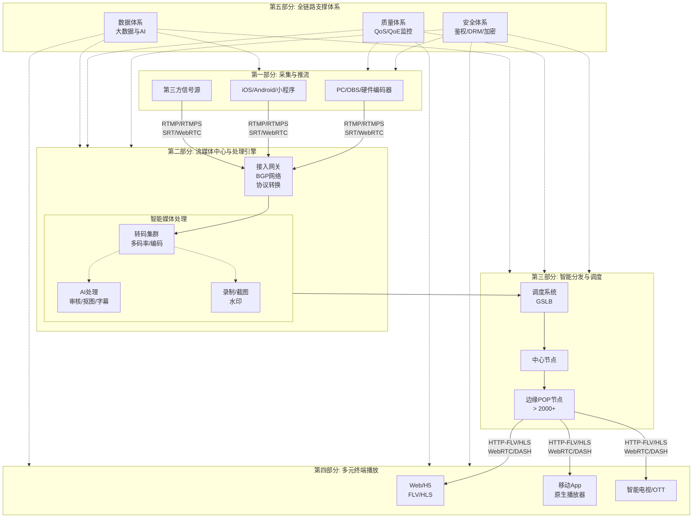
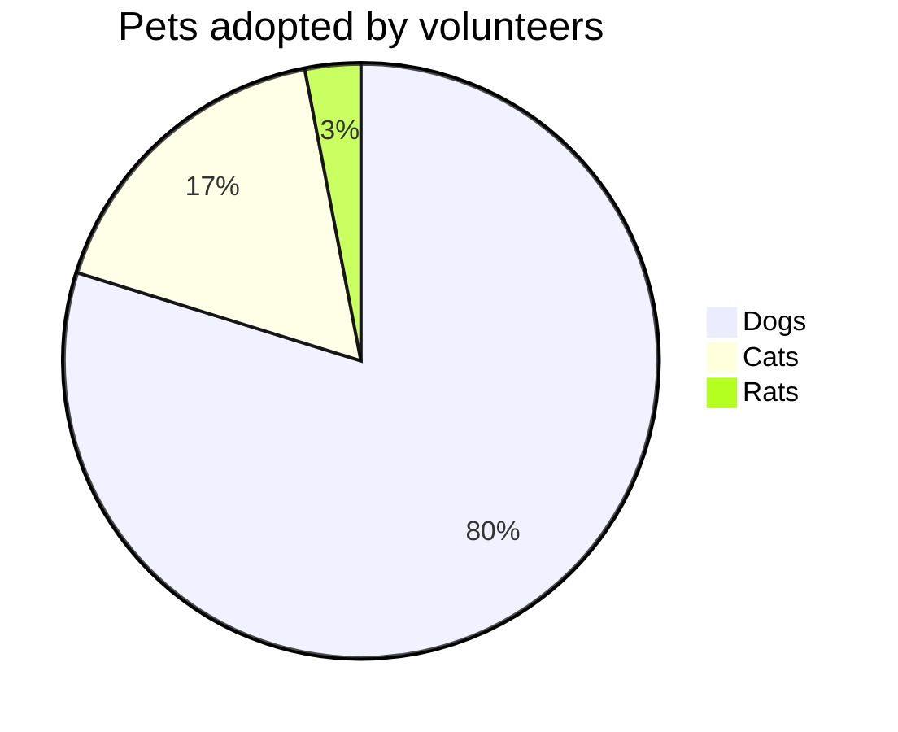

## 目录
- [第一章](#第一章)
- [第二章](#第二章)

## 第一章 
这里是第一章内容...

## 第二章 
这里是第二章内容...

## 各种样式

**加粗字体** 或 __加粗文字__
*斜体* 或 _斜体_
***加粗斜体***
~~删除线文字~~
`行内代码` 或 `变量名`
> 这是引用文字，常用于强调或注释。

[链接名](链接地址)
这是一个带脚注的句子[^1] <!-- 这是一个注释，不会在渲染后显示 -->
[^1]: 这是脚注内容，通常显示在页面底部

折叠/可展开区块 点击展开详细内容

这里是隐藏的内容！

键盘样式
<kbd>Ctrl</kbd> + <kbd>Shift</kbd> + <kbd>C</kbd>

分隔线后非标准Markdown支持 vscode上推荐[Markdown Preview Enhanced](https://marketplace.visualstudio.com/items?itemName=shd101wyy.markdown-preview-enhanced)插件
___
***
---
==高亮文字==（⚠️ 非标准 Markdown）
红色文字（⚠️ 非标准 Markdown）
<u>带下划线的文字</u>（⚠️ 非标准 Markdown）
H2O 和 E = mc2（上标 / 下标（⚠️ 非标准）

Emoji 表情
:smile: :rocket: :heart:

特色符号
&copy; &trade; &reg; &hearts; &rarr; &larr; &hellip;

LaTeX行内公式 $E = mc^2$

LaTeX块级公式

$$
\int_{-\infty}^{\infty} e^{-x^2} dx = \sqrt{\pi}
$$

$$
\mathbf{A} = 
\begin{bmatrix}
A_x \\ A_y \\ A_z
\end{bmatrix}
$$

$$
\mathbf{B} = \begin{bmatrix}
B_x & B_y & B_z \\
\end{bmatrix}
$$

$$
\mathbf{C} = 
\begin{bmatrix}
C_x & C_y & C_z
\end{bmatrix}^\top
$$

## 表格
| 姓名   | 年龄 | 城市     |
|--------|------|----------|
| 张三   | 25   | 北京     |
| 李四   | 30   | 上海     |

支持对齐：
| 左对齐 | 居中对齐 | 右对齐 |
|:-------|:-------:|-------:|
| A      | B       | C      |

## Markdown 分条语法

### 1. 有序列表 (Ordered List)
使用数字加英文句点 `.` 开头，后面跟空格，再写内容。
数字本身不重要（都会按 1,2,3... 显示），但必须是递增的。

1. 第一条
2. 第二条
3. 第三条

> 注意：实际渲染时，上面的 `2.` 和 `3.` 会被自动调整为 `2.` 和 `3.`，即使你写成：
>
> 1. 第一条
> 5. 第二条
> 3. 第三条
>
> 渲染结果依然是 1, 2, 3。

### 2. 无序列表 (Unordered List)
使用以下任意一种符号加空格开头：

- 减号 `-`
  - 二级项目
  - 二级项目
- 星号 `*`
  * 二级项目
  * 二级项目
    + 三级项目
        - 四级项目
- 加号 `+`
  + 二级项目
  + 二级项目

> 三种符号 `-`、`*`、`+` 在大多数 Markdown 解析器中效果相同，通常显示为圆点 •。

### 3. 混合使用（有序 + 无序）
你可以在有序列表中嵌套无序列表，只需正确缩进：

1. 主任务一
   - 子任务 A
   - 子任务 B
2. 主任务二
   * 子任务 X
   * 子任务 Y
3. 主任务三
   + 步骤 1
   + 步骤 2

- 1. 主任务四
    - 1. 步骤1
    - 2. 步骤 2
- 2. 主任务五

### 4. 任务列表 (Task List) - GitHub Flavored Markdown
在支持的平台（如 GitHub、GitLab）上，可以创建可勾选的待办事项：

- [x] 已完成任务
- [ ] 待办任务一
- [ ] 待办任务二

## 嵌入内容

<iframe width="560" height="315" src="https://www.youtube.com/embed/xxx嵌入视频" frameborder="0"></iframe>

## mermaid图
[mermaid在线编辑器支持导出图](https://mermaid.live/)

